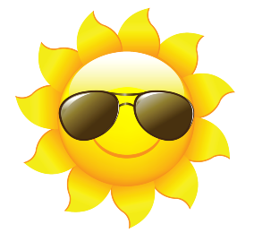

    

# ⛅ Previsão do tempo

Um simples aplicativo web em ReactJS que exibe informações sobre o tempo, este projeto tem o objetivo de demostrar minhas habilidade de desenvolvimento com as seguintes tecnologias.
 

  
  
  
  
  
  

